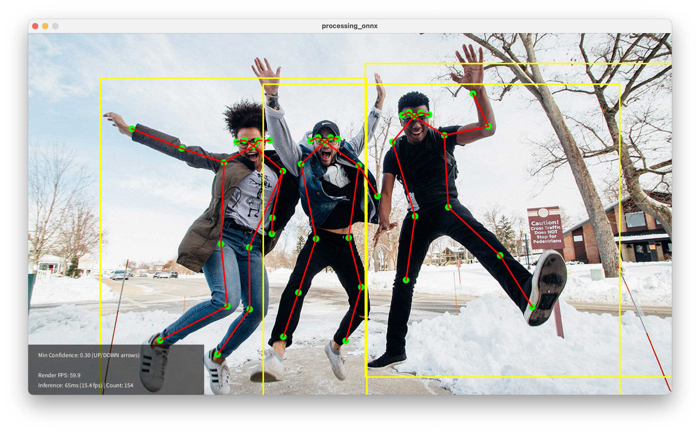

# Processing ONNX example w/MoveNet Lightning Multipose

This is an example of using the Java ONNX Runtime API within Processing to run the MoveNet Lightning Multipose model for human pose estimation. The model detects up to 6 people in an image and provides 17 keypoint skeletal coordinates, along with a bounding box and confidence score for each detected person.

## Requirements

- Processing 4.x
- Java ONNX Runtime library (included in the `code` folder)
- MoveNet Lightning Multipose ONNX model file (included in the `data` folder)

## About the Code

- This uses the CPU execution provider for ONNX Runtime. There are GPU-specific providers, but they require additional setup.
- The native library files for Windows and Apple Silicon (M1+) are included in the `/code` directory, where Processing looks for external .jar files. These were extracted from the onnxruntime jar file, which solved problems where the library couldn't find its native dependencies. You may need to add the appropriate native library for your platform if you're using Linux or Intel-based Macs.
- The onnxruntime jar is a slightly older version (1.19.2), which was more compatible with Processing's Java environment at the time of writing.
- Threading: The ONNX inference is run in a separate thread to keep the Processing sketch running smoothly.
- ONNX input data: The input image is resized to 256x256 pixels and normalized before being fed into the model. ONNX models tend to have a required input size and data format.
- Output parsing: The model outputs a large multidimensional array of detected people, each with keypoints, bounding box coordinates, and confidence scores. The code extracts this information, converts it into Java objects, and visualizes it on top of the image.